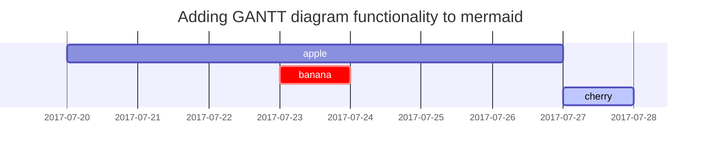

## Titles
---

```markdown
# H1 - heading
## H2 - heading
### H3 - heading
#### h4 - heading
```
<h1 data-toc-skip>H1 - heading</h1>
<h2 data-toc-skip>H2 - heading</h2>
<h3 data-toc-skip>H3 - heading</h3>
<h4 data-toc-skip>H4 - heading</h4>
<br><br>

## Paragraph
---
```markdown
Apple Inc. is an American multinational technology company

headquratered in Cupertino, California, that designs, develops,

and sells consumer electronics, computer software, and online services

(Source from Wikipedia)
```
Apple Inc. is an American multinational technology company

headquratered in Cupertino, California, that designs, develops,

and sells consumer electronics, computer software, and online services

(Source from Wikipedia)

<br><br>
## Lists
---
### Ordered list

```markdown
1. First
2. Second
3. Third
```
1. First
2. Second
3. Third

### Unordered list

```markdown
- First
	- Second
		- Third
```

- First
	- Second
		- Third
<br><br>

### Task list

```markdown
- [ ] First
- [x] Second
- [ ] Third
  - [x] 1
  - [ ] 2
  - [ ] 3
```

- [ ] First
- [x] Second
- [ ] Third
  - [x] 1
  - [ ] 2
  - [ ] 3

### Description list
```markdown
Sun
: the star around which the earth orbits

Moon
: the natural satellite of the earth, visible by reflected light from the sun
```

Sun
: the star around which the earth orbits

Moon
: the natural satellite of the earth, visible by reflected light from the sun
<br><br>

## Block Quote
---
```markdown
> First Block Quote
> > Second Block Quote
> > > Third Block Quote
```

> First Block Quote
> > Second Block Quote
> > > Third Block Quote
<br><br>

## Tables
---
```markdown
| Fruits | Color  | Price    |
|:-------|--------|---------:|
| Apple  | Red    | 3000 won |
| Banana | Yellow | 5000 won |
| Orange | Orange | 3000 won |
```

| Fruits | Color  | Price    |
|:-------|:------:|---------:|
| Apple  | Red    | 3000 won |
| Banana | Yellow | 5000 won |
| Orange | Orange | 3000 won |

<br><br>
## Links
---
```markdown
<http://127.0.0.1:4000>
[link](http://127.0.0.1:4000)
```
<http://127.0.0.1:4000>  
[link](http://127.0.0.1:4000)
<br><br>

## Footnote
---
```markdown
This is a footnote[^1] and this is another one[^2]. This is the last one[^3].
```
This is a footnote[^1] and this is another one[^2]. This is the last one[^3].
<br><br>

## Images
---
- Default (with caption)


_Full screen width and center alignment_

<br>

- Specify width

{: width="400"}
_400px image width_

<br>

- Left aligned

{: width="350" .normal}

<br>

- Float to left

  {: width="240" .left}
  "A repetitive and meaningless text is used to fill the space. A repetitive and meaningless text is used to fill the space. A repetitive and meaningless text is used to fill the space. A repetitive and meaningless text is used to fill the space. A repetitive and meaningless text is used to fill the space. A repetitive and meaningless text is used to fill the space. A repetitive and meaningless text is used to fill the space. A repetitive and meaningless text is used to fill the space. A repetitive and meaningless text is used to fill the space. A repetitive and meaningless text is used to fill the space. A repetitive and meaningless text is used to fill the space. A repetitive and meaningless text is used to fill the space."

<br>

- Float to right

  {: width="240" .right}
  "A repetitive and meaningless text is used to fill the space. A repetitive and meaningless text is used to fill the space. A repetitive and meaningless text is used to fill the space. A repetitive and meaningless text is used to fill the space. A repetitive and meaningless text is used to fill the space. A repetitive and meaningless text is used to fill the space. A repetitive and meaningless text is used to fill the space. A repetitive and meaningless text is used to fill the space. A repetitive and meaningless text is used to fill the space. A repetitive and meaningless text is used to fill the space. A repetitive and meaningless text is used to fill the space. A repetitive and meaningless text is used to fill the space."

<br>

## Mermaid SVG




## Mathematics

The mathematics powered by [**MathJax**](https://www.mathjax.org/):

$$ \sum_{n=1}^\infty 1/n^2 = \frac{\pi^2}{6} $$

When $a \ne 0$, there are two solutions to $ax^2 + bx + c = 0$ and they are

$$ x = {-b \pm \sqrt{b^2-4ac} \over 2a} $$


## Inline code

This is an example of `Inline Code`.


## Code block

### Common

```
This is a common code snippet, without syntax highlight and line number.
```

### Specific Languages

#### Console

```console
$ env |grep SHELL
SHELL=/usr/local/bin/bash
PYENV_SHELL=bash
```

#### Ruby

```ruby
def sum_eq_n?(arr, n)
  return true if arr.empty? && n == 0
  arr.product(arr).reject { |a,b| a == b }.any? { |a,b| a + b == n }
end
```

#### Shell

```shell
if [ $? -ne 0 ]; then
    echo "The command was not successful.";
    #do the needful / exit
fi;
```

#### Liquid


```liquid

  This product's title contains the word Pack.

```


#### Java

```java
private void writeObject(java.io.ObjectOutputStream s)
  throws java.io.IOException {
  // Write out any hidden serialization magic
  s.defaultWriteObject();
  for (E e: map.keySet()) s.writeObject(e);
}
```

#### Swift
```swift
func printValue(value: String) {
	print("The value is : \(value)")
}
```

## Reverse Footnote

[^1]: First Footnote
[^2]: Second Footnote
[^3]: Third Footnote
